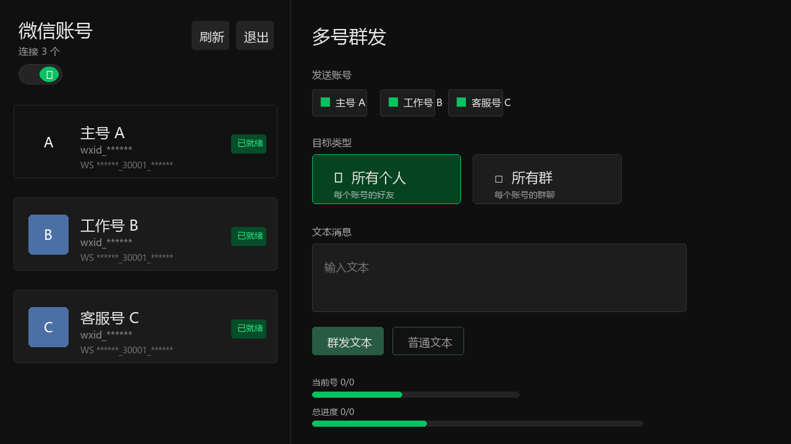
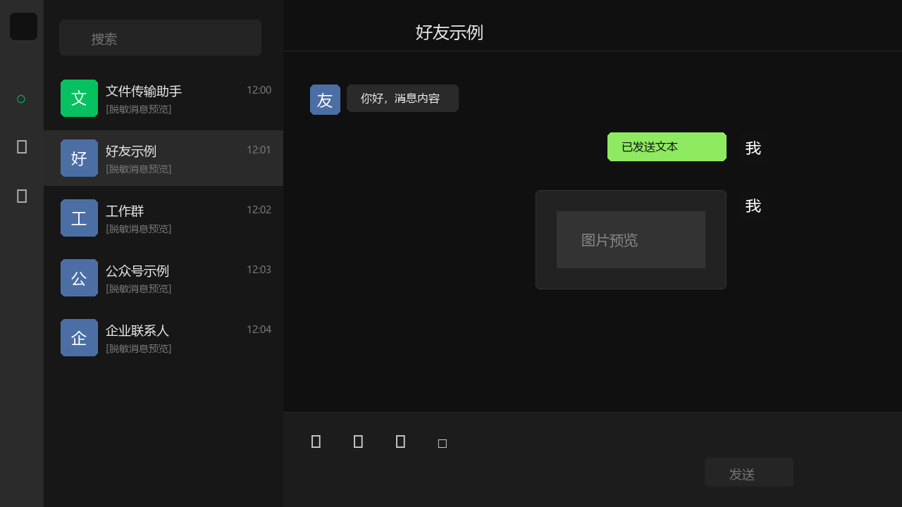
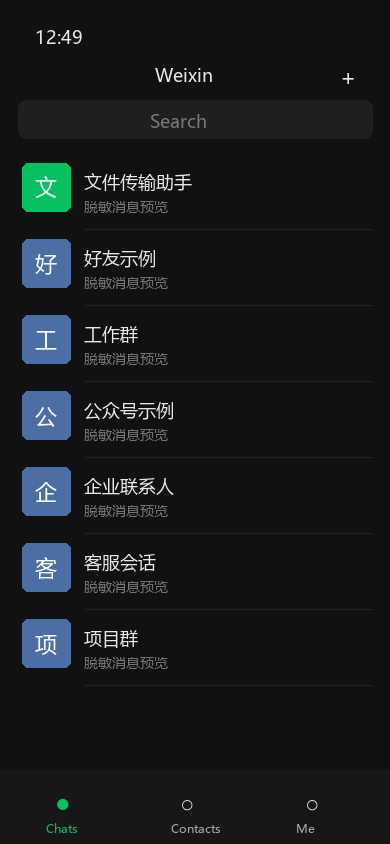
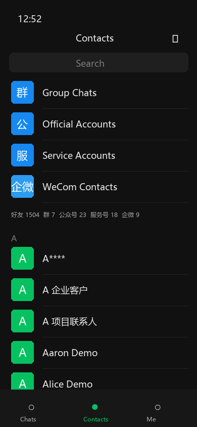

# WeChat Web Client

一个基于 FastAPI + React 的微信 Web 客户端示例项目，用于连接本地或远程微信 Hook/协议服务，提供会话列表、聊天消息、媒体加载、发送消息和实时回调展示等能力。

> 注意：本项目涉及微信 Hook/协议相关能力，请仅在你拥有授权的环境中学习、测试和使用，并自行遵守相关法律法规与平台规则。

## 功能特性

- 支持 `local_hook`、`remote_hook`、`remote_protocol` 三种连接模式；其中 `remote_hook` 表示远程客户端 Hook。
- 支持远程客户端 DLL 通过 `ws://.../agent` 或 `wss://.../agent` 主动连到后端，客户端不需要公网 IP，后端复用现有接口封装向 DLL 发送 JSON 调用。
- 支持多微信账号管理，按远程 Hook `agent_id` 与回调 `selfwxid` 隔离不同账号的数据、会话和联系人缓存。
- 支持访问密钥进入系统，进入后先展示微信账号卡片，再进入对应账号的聊天窗口，避免未授权用户直接看到聊天记录。
- 后端使用 FastAPI 封装微信 Hook/协议接口，并通过 WebSocket 向前端推送账号状态、会话、联系人和新消息。
- 前端使用 React + TypeScript + Vite，实现类似 PC 微信和手机微信的聊天、通讯录和个人资料界面。
- 支持会话列表、置顶标识、未读数、@我提示、右键菜单、头像缓存、历史消息缓存和本地 SQLite 预加载。
- 支持联系人通讯录：首次点击通讯录时调用 `InitContact` 获取完整 wxid/gid 列表，再按每批最多 100 个调用 `GetContact` 补全头像、昵称和画像；后续优先读取本地 SQLite。
- 通讯录按个人、群聊、公众号、服务号、企业微信联系人分类展示，并显示好友、群、公众号、服务号、企微数量；企业微信联系人使用 `企微` 标识。
- 支持群聊成员详情缓存，可通过 `GetChatrooMmemberDetail` 获取群成员头像、昵称并复用到群资料页。
- 支持文本、图片、文件发送，以及图片、表情、语音、视频、网址消息等展示；图片/文件类接口支持 `fileData` 方式，适配远程 Hook。
- 支持单号群发和多号群发，可按所有好友/所有群分类发送，支持 `_NoSrc` 高效发送和普通发送两种方式。
- 多号群发支持账号手动选择、全选/取消全选、当前账号进度、总进度和用户配置的并发上限。
- 支持手机端自适应访问，包含 Chats / Contacts / Me 底部导航、联系人分类页、资料页、聊天页，以及左右滑动进入/返回的页面过渡。
- 支持白天/夜晚模式，PC 和手机页面统一主题风格。
- 提供自动登录脚本 `backend/login_remote_hook.py`，可优先尝试免扫码登录，失败后回退到扫码登录。

## 页面效果

以下图片为脱敏示意效果图，只展示布局和功能区域，不包含真实聊天记录、账号密钥或业务数据。

### PC 端





### 手机端





## 技术栈

- 后端：Python、FastAPI、Uvicorn、httpx、WebSocket、PyYAML
- 前端：React、TypeScript、Vite、Tailwind CSS
- 通信：REST API + WebSocket

## 目录结构

```text
wechat_web/
├── backend/              # FastAPI 后端与微信接口封装
├── frontend/             # React + Vite 前端
├── config.example.yaml   # 脱敏配置模板
├── config.yaml           # 本地运行配置（不会提交到 Git）
└── README.md
```

## 快速开始

### 1. 准备配置

复制配置模板：

```bash
cp config.example.yaml config.yaml
```

然后根据你的 Hook/协议服务地址、端口和回调公网 IP 修改 `config.yaml`。

### 2. 启动后端

后端推荐使用 Python 3.13；`start-all.bat` / `start-all.sh` 会优先使用 Python 3.13。若系统里有多个 Python，可通过 `PYTHON_BIN` 指定 3.13 解释器。

```bash
cd backend
pip install -r requirements.txt
python login_remote_hook.py
python main.py
```

后端默认监听 `5000` 端口，回调端口由 `config.yaml` 中的 `callback_port` 控制。

### 3. 启动前端

```bash
cd frontend
npm install
npm run dev
```

前端开发服务默认由 Vite 启动，接口通过同源代理访问后端。

## 常用命令

```bash
# 前端构建
cd frontend
npm run build

# 指定 Python 3.13 启动（Linux/macOS 示例）
PYTHON_BIN=/usr/bin/python3.13 ./start-all.sh

# 前端代码检查
cd frontend
npm run lint
```

## 配置说明

`config.yaml` 不会被提交到仓库。公开部署或提交代码前，请确认没有把真实 IP、Token、账号信息、日志、缓存文件或聊天媒体数据提交到 Git。

### 远程 Hook DLL 启动参数

使用远程 Hook 模式时，DLL 启动微信的参数必须带 `RemoteWS`。该参数用于让远程微信客户端主动建立到 Web 后端的 WebSocket 长连接，后端后续的接口调用会通过这条连接转发给对应的 Hook 客户端。

示例：

```text
"C:\Program Files (x86)\Tencent\WeChat391016\WeChat\WeChat.exe" CallBackURL=http://localhost:8000/receiveChatBotMsg&RecvType=1&ConnectType=http&RemoteWS="ws://1.14.149.2:5000/agent"&StartPort=30001&RDV=<客户端自己的RDV>
```

`RemoteWS` 支持两种形式：

- `ws://host:port/agent`：普通 WebSocket，适合内网、测试环境，或后端端口直接暴露的部署方式。
- `wss://host/agent`：TLS 加密 WebSocket，适合公网正式部署，通常由 Nginx/Caddy 等反向代理提供 HTTPS/WSS 证书，并转发到后端服务端口。

如果有多个微信客户端，每个客户端仍连接同一个 `RemoteWS` 地址；项目会根据远程 Hook 上报的 `agent_id` 和回调里的 `selfwxid` 区分不同微信号。

主要配置项：

- `wechat_mode`：微信使用方式，`1`=本地 Hook，`2`=远程客户端 Hook（客户端 DLL 主动连本后端 WS/WSS），`3`=远程服务器协议。旧配置 `login` 仍兼容，可选 `local_hook`、`remote_hook`、`remote_protocol`。
- `*_host` / `*_api_port` / `*_mgr_port`：不同模式下的服务地址和端口。
- `ip`：本后端的公网 IP 或域名，供远程客户端 DLL 主动连接和回调访问。
- `server_port`：后端主服务端口。
- `web_access_key`：Web 前端和 `/api/*` 接口访问密钥；不要提交真实值，可在本地 `config.yaml` 或环境变量 `WECHAT_WEB_ACCESS_KEY` 中配置。
- `hook_api_concurrency`：Hook/API 并发数；本地 Hook 默认 `1`，远程 Hook/远程协议默认 `10`，用于避免慢查询阻塞 `GetContact`、头像、发送消息等交互接口。
- `frontend_port`：前端页面端口，`start-all.sh` 会优先读取此配置；也可用环境变量 `FRONTEND_PORT` 临时覆盖。
- `agent_ws_enabled`：是否启用远程客户端 DLL 主动连接本后端的 `/agent` WebSocket 通道；启用后 Hook API 调用会通过这条长连接发给 DLL。
- `agent_ws_path`：DLL 连接路径，默认 `/agent`。
- `client_wss_host` / `client_wss_port` / `client_wss_scheme`：生成 DLL 侧 `RemoteWS` 地址用的公网主机、端口和协议；无证书测试可用 `client_wss_scheme: "ws"`、`client_wss_port: 5000`，DLL 配置 `RemoteWS="ws://1.14.149.2:5000/agent"`；正式 TLS 部署用 `client_wss_scheme: "wss"`、`client_wss_port: 443`，DLL 配置 `RemoteWS="wss://1.14.149.2/agent"`。
- 使用 `wss` 时，公网 `client_wss_port` 需要由反向代理或外层 TLS 服务转发到后端 `server_port`，并保留 WebSocket Upgrade 头；使用 `ws://IP:5000` 测试时可直连后端服务端口。
- `callback_port` / `callback_path`：远程客户端 Hook 回调本后端的地址配置。
- `recvtype`：Hook 消息接收类型，默认 `1`；`1` 为 Hook 直接返回 `msglist`，`2` 为 protobuf/raw `pb_msg`。旧配置 `recv_type` 仍兼容。
- `WECHAT_FILES_BASE`：可选环境变量，用于指定本机微信文件目录；不设置时会按默认微信文件目录推导。

## 开源前注意事项

- `frontend/node_modules/`、后端缓存、上传文件、日志和本地配置均已通过 `.gitignore` 排除。
- 如果你已经误提交敏感配置，请立即撤销对应密钥或令牌，并清理 Git 历史。
- 本仓库默认不包含可运行的微信 Hook 服务本体，需要你自行准备对应服务。
